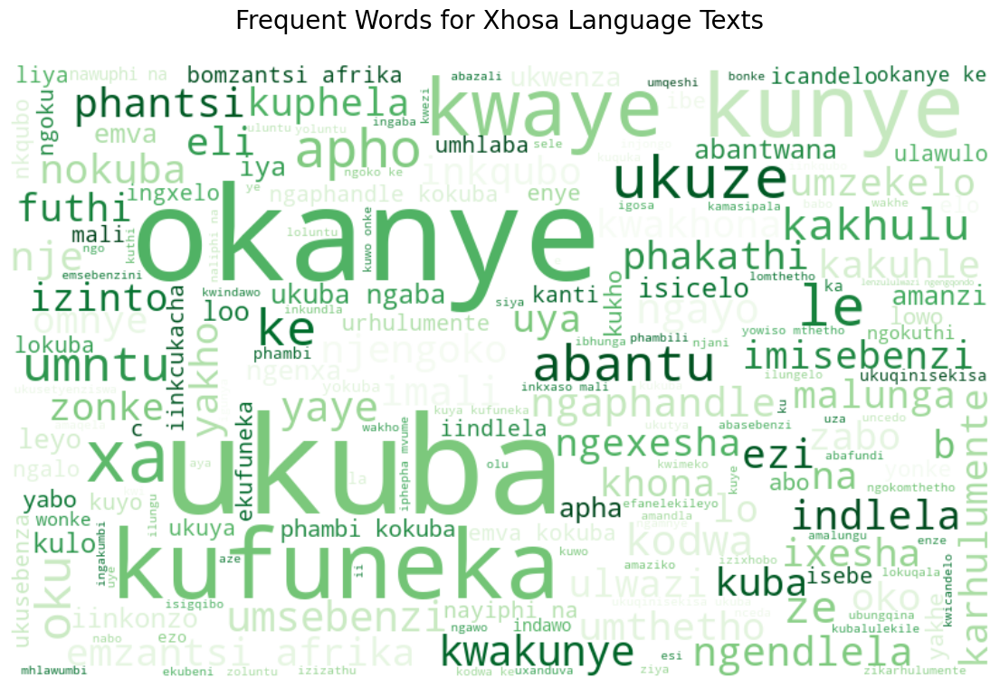

# EDSA 2023 Classification Hackathon

## Overview
South Africa's rich linguistic diversity presents a unique challenge, necessitating an adept language identification system. The 11 official languages demand precise communication, prompting the implementation of advanced Natural Language Processing (NLP) techniques. This exploration endeavors to enhance communication by developing a versatile language identification algorithm tailored to South Africa's linguistic nuances.

# Objectives
In this intriguing challenge, I embarked on a journey to:
- Implement a language identification system utilizing advanced NLP techniques to analyze diverse texts.
- Attain precise language identification across South Africa's 11 official languages for effective communication.
- Enable algorithm to conduct language-specific processing, accommodating the country's linguistic diversity.
- Develop a proficient system recognizing and interpreting texts in all 11 official languages, enhancing communication.
- Create a versatile system supporting applications reliant on language-specific processing, boosting overall functionality.
- Tailor the language identification algorithm to seamlessly integrate with South Africa's linguistic nuances, ensuring inclusivity and accuracy.

# Tools and Technology
- Development Language: Python 🐍
- Machine Learning Libraries: Utilizing scikit-learn and nltk 📚
- Experiment Tracking: Employing Comet for systematic recording 📜
- Model Evaluation: Assessing model efficiency through Kaggle submission on an unseen dataset.

# Data Preprocessing
A dedicated function was employed to eliminate **Noise** in the dataset by performing the following operations:

- Removal of punctuations.
- Conversion of text to lowercase.
- Elimination of links.
- Removal of extra spaces.
- Handling of other special characters.

**Additional NLP preprocessing techniques were applied, including text tokenization, removal of stop words, and stemming using SnowballStemmer.**

# Exploratory Data Analysis
The dataset includes both training and test set data, covering 11 distinct South African languages. The following visual provides an overview of the distribution of these 11 languages.

The language distribution plot reveals a well-balanced representation, with approximately 30,000 instances for each of South Africa's 11 unique languages. Each language is visually distinguished by a unique color, such as green for Xhosa, blue for English, orange for Sepedi, red for Venda, and so forth. This color-coded approach enhances clarity, aiding in easy identification and differentiation of each language. The uniform distribution ensures a diverse dataset for robust training of a language identification system, while the distinct colors contribute to clear visual analysis.

## Analyzing Each Language Separately
### Visualizing Xhosa Language Texts

The WordCloud for Xhosa Language reveals the prominence of specific words, including "okanye," "ukuba," "kufuneka," and more. These boldened words represent distinctive linguistic elements commonly used in Xhosa. Their prevalence underscores the rich presence of Xhosa language in the dataset, emphasizing its significant contribution to the overall linguistic diversity of the text data.

### Visualizing English Language Texts

The WordCloud for English Language Texts reveals the frequent occurrence of key terms such as "act," "service," "minister," "must," "section," "may," "national," "department," "person," and "member." These highlighted words represent common and important vocabulary in English, indicating their prevalence in the dataset.

### Visualizing Sepedi Language Texts

The WordCloud analysis for Sepedi Language Texts showcases recurring words such as "ka," "yeo," "le," "bjalo," "thsedimo," "wa," "ke," "go ye," "gomme," "afrika," "diswanet," and "bao." These highlighted terms represent the prevalent vocabulary within the Sepedi language in the dataset. The bold appearance of these words underscores their frequency and importance, offering insights into the linguistic patterns and thematic elements present in the Sepedi texts

### Visualizing Venda Language Texts

In Venda Language texts, significant words such as "kha," "vha," "ha," and others stand out prominently. These boldened terms indicate the recurrent presence of specific words within the Venda language in the dataset.

### Visualizing Tswana Language Texts

Tswana Language Texts showcases key terms such as "browa," "tse," "tshwanetse," "bo," "le," "jaaka," "mo," "haba," "batho," "dire," "okgotsa," "gongwe," "ya," and others. These prominently displayed words highlight the most frequent terms within the Tswana language in the dataset.

### Visualizing IsiNdebele Language Texts

The IsiNdebele language texts showcase key terms like "namkha," "bona," "lanho," "nakube," "begodu," "khoma," "khule," "ukuthi," "lokhu," "kodwana," "bese," and "kanye." These words highlight the most frequent terms within the IsiNdebele language in the dataset, providing valuable insights into the prevalent vocabulary and linguistic patterns of the language.

### Visualizing Zulu Language Texts

The Zulu language texts prominently feature terms such as "noma," "ukuthi," "lapho," "kodwa," "kanye," "amandla," "bese," "kukhulu," "kahulumeni," "umuntu," "ngendlela," "ukuba," "futhi," and "uma." These words represent the most frequent terms within the Zulu language in the dataset, offering insights into the common vocabulary and linguistic characteristics of the language.

### Visualizing Swati Language Texts

The Swati language texts prominently showcase words like "umuntfu," "sicelo," "kuphela," "bantfwana," "kufanele," "ngabe," "kantsi," "ngesikhatsi," and "kute." These words represent the most frequent terms within the Swati language in the dataset, providing insights into the common vocabulary and linguistic characteristics of the language.

### Visualizing Tsonga Language Texts

Within the Tsonga language texts, key words like "fanele," "leswaku," "loko," "hi," "ku," "xi," "va," "nga," "eka," "kumbe," "naswona," "swi," and "yi" are prominently displayed. These words stand out as the most frequent texts in the Tsonga language within the dataset, offering insights into the prevalent vocabulary and linguistic characteristics of this language.

### Visualizing Sotho Language Texts

The Sotho language texts prominently feature terms such as "bakeng," "kapa," "borwa," "mabapi," "Afrika," "di," "jwalo," "molao," "hore," and "nang." These terms, boldly displayed, represent the most frequent words within the Sotho language in the dataset, shedding light on the prevalent vocabulary and linguistic characteristics of this language.

### Visualizing Afrikaans Language Texts

The Afrikaans language texts prominently feature terms such as "en," "van," "moet," "die," "department," "word," "met," "hulle," "enige," "nasionale," "Afrikaanse," "opsigte," and others. These terms, boldly displayed, represent the most frequent words within the Afrikaans language in the dataset, offering insights into the common vocabulary and linguistic characteristics of Afrikaans.

**Analyzing Language Texts Collectively**

In general, analysis of the 11 different languages reveals both commonalities and distinctions among the most frequent texts in the dataset. Some terms, such as "en," "van," "moet," and "die," consistently appear, hinting at shared vocabulary or loanwords across multiple languages. However, each language exhibits unique terms, contributing to distinct patterns observed in the visualization. This diversity of language-specific texts underscores the importance of a robust language identification system capable of accurately distinguishing between the 11 official languages in South Africa's multilingual environment.

# Data Engineering
## Text Vectorization: 
Text data underwent TF-IDF vectorization, a crucial step applied consistently to both the training and test datasets.

## Train-Test Split
The training dataset was divided into two subsets, X_train and X_test, along with their corresponding language labels, y_train and y_test. This division was performed using the train_test_split method with a specified test size of 20% and a random seed of 50 for reproducibility.

## Feature Selection for Dimension Reduction
Implemented SelectKBest utilizing the F-statistic to identify and retain the most influential 21,000 features, thereby optimizing dimensionality for improved model efficiency.

# Model Selection
Three distinct models were evaluated during the experimentation phase:
- Ridge Classifier Model.
- Support Vector Classifier.
- Naive Bayes.

## Snapshot of Ridge Classifier Model Classification Report

The classification report shows that;  the Ridge Classifier Model demonstrates outstanding accuracy and effectiveness in classifying texts into their respective languages, as evidenced by having high precision, recall, and F1-score of 1.00 values for each language class.

##  Model Evaluation
The model achieved an F1-score of 0.99878 on the test dataset, indicating also high precision and recall performance.

## For Support Vector Classifier Evaluation
The classification report for the Support Vector Classifier (SVC) mirrors that of the Ridge Classifier Model. Leveraging hyperparameter tuning with a gamma type for SVC, it achieved a comparable F1-Score of 0.9986, aligning closely with the performance observed in the Ridge Classifier Model.

## Snapshot of Multinomial Naive Bayes Model Classification Report

The classification report for the Multinomial Naive Bayes model reveals exceptional performance, with precision, recall, and F1-score consistently reaching 1.00 across all language classes. This remarkable accuracy highlights the model's effectiveness in accurately classifying texts into their respective languages, surpassing the performance of the other models.

## Model Evaluation
The Multinomial Naive Bayes model achieved the following performance metrics:
- F1-Score on the test dataset: 0.99924.
- Accuracy on the test dataset: 0.99924.

# Comet Experiment Snapshot

# Evaluating Model Performances on Kaggle
Each model underwent conversion into the requisite CSV file and was subsequently submitted on Kaggle to evaluate its performance on unseen data. The F1-Scores attained upon Kaggle submission are as follows:

Ridge Classifier Model: 0.9692
Support Vector Classifier: 0.9692
The Multinomial Naive Bayes achieved the highest F1-Score, recording 0.97307 on submission. This remarkable performance propelled me to the 27th position on the leaderboard, outperforming 225 other participants in the Kaggle competition.

# Conclusion
In conclusion, this exploratory journey into South Africa's linguistic diversity leveraged advanced Natural Language Processing (NLP) techniques to unravel nuances within the country's 11 official languages. The analysis, spanning from visualizing unique words to uncovering shared vocabulary, yielded a comprehensive understanding of the linguistic landscape. The preprocessing pipeline involved TF-IDF vectorization, dimensionality reduction with SelectKBest and F-statistic, and meticulous training on well-split datasets, ensuring a robust approach.

Three models—Ridge Classifier, Support Vector Classifier, and Multinomial Naive Bayes—were rigorously evaluated, with Multinomial Naive Bayes emerging as the most effective. The meticulous tracking of model performance using Comet added transparency and reproducibility to the experimentation. The culmination of these efforts was evident in Kaggle submissions, where Multinomial Naive Bayes not only outperformed its counterparts but also secured an impressive position on the leaderboard. This comprehensive exploration not only enriched insights into South Africa's linguistic fabric but also showcased the potential of NLP techniques in advancing language-specific applications within multicultural societies.

# Citation
ExploreAI Academy. (2023). South African Language Identification Hack 2023.

