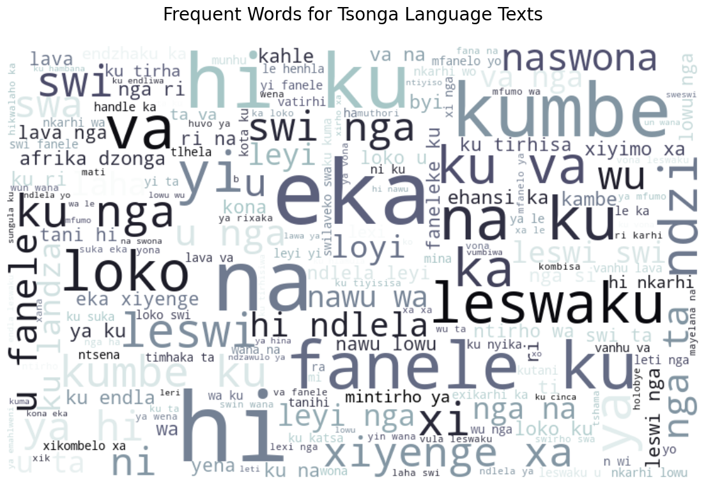

# EDSA 2023 Classification Hackathon

## Overview
South Africa stands as a multicultural society, distinguished by its profound linguistic diversity. Language, being a vital instrument, not only serves to enhance democracy but also plays a pivotal role in shaping the multifaceted aspects of social, cultural, intellectual, economic, and political life within the South African society.

Marked by the assurance of equal status for each, the country embraces a multilingual landscape with 11 official languages. The majority of South Africans exhibit multilingualism, proficiently speaking two or more of these designated official languages. Given the widespread multilingual proficiency among the population, it becomes evident that our systems and devices must effectively communicate in a diverse linguistic environment.

# Objectives
In this intriguing challenge, I embarked on a journey to:
- Implement a language identification system utilizing advanced NLP techniques to analyze diverse texts.
- Attain precise language identification across South Africa's 11 official languages for effective communication.
- Enable algorithm to conduct language-specific processing, accommodating the country's linguistic diversity.
- Develop a proficient system recognizing and interpreting texts in all 11 official languages, enhancing communication.
- Create a versatile system supporting applications reliant on language-specific processing, boosting overall functionality.
- Tailor the language identification algorithm to seamlessly integrate with South Africa's linguistic nuances, ensuring inclusivity and accuracy.

# Tools and Technology
- Development Language: Python 🐍
- Machine Learning Libraries: Utilizing scikit-learn and nltk 📚
- Experiment Tracking: Employing Comet for systematic recording 📜
- Model Evaluation: Assessing model efficiency through Kaggle submission on an unseen dataset.

# Data Preprocessing
A dedicated function was employed to eliminate **Noise** in the dataset by performing the following operations:

- Removal of punctuations.
- Conversion of text to lowercase.
- Elimination of links.
- Removal of extra spaces.
- Handling of other special characters.

**Additional NLP preprocessing techniques were applied, including text tokenization, removal of stop words, and stemming using SnowballStemmer.**

# Exploratory Data Analysis
The dataset includes both training and test set data, covering 11 distinct South African languages. The following visual provides an overview of the distribution of these 11 languages.

The language distribution plot reveals a well-balanced representation, with approximately 30,000 instances for each of South Africa's 11 unique languages. Each language is visually distinguished by a unique color, such as green for Xhosa, blue for English, orange for Sepedi, red for Venda, and so forth. This color-coded approach enhances clarity, aiding in easy identification and differentiation of each language. The uniform distribution ensures a diverse dataset for robust training of a language identification system, while the distinct colors contribute to clear visual analysis.

## Analyzing Each Language Separately
**Visualizing Xhosa Language Texts**

The WordCloud for Xhosa Language reveals the prominence of specific words, including "okanye," "ukuba," "kufuneka," and more. These boldened words represent distinctive linguistic elements commonly used in Xhosa. Their prevalence underscores the rich presence of Xhosa language in the dataset, emphasizing its significant contribution to the overall linguistic diversity of the text data.

**Visualizing English Language Texts**

The WordCloud for English Language Texts reveals the frequent occurrence of key terms such as "act," "service," "minister," "must," "section," "may," "national," "department," "person," and "member." These highlighted words represent common and important vocabulary in English, indicating their prevalence in the dataset.

**Visualizing Sepedi Language Texts**

The WordCloud analysis for Sepedi Language Texts showcases recurring words such as "ka," "yeo," "le," "bjalo," "thsedimo," "wa," "ke," "go ye," "gomme," "afrika," "diswanet," and "bao." These highlighted terms represent the prevalent vocabulary within the Sepedi language in the dataset. The bold appearance of these words underscores their frequency and importance, offering insights into the linguistic patterns and thematic elements present in the Sepedi texts

**Visualizing Venda Language Texts**

In Venda Language texts, significant words such as "kha," "vha," "ha," and others stand out prominently. These boldened terms indicate the recurrent presence of specific words within the Venda language in the dataset.

**Visualizing Tswana Language Texts**

Tswana Language Texts showcases key terms such as "browa," "tse," "tshwanetse," "bo," "le," "jaaka," "mo," "haba," "batho," "dire," "okgotsa," "gongwe," "ya," and others. These prominently displayed words highlight the most frequent terms within the Tswana language in the dataset.

**Visualizing IsiNdebele Language Texts**

The IsiNdebele language texts showcase key terms like "namkha," "bona," "lanho," "nakube," "begodu," "khoma," "khule," "ukuthi," "lokhu," "kodwana," "bese," and "kanye." These words highlight the most frequent terms within the IsiNdebele language in the dataset, providing valuable insights into the prevalent vocabulary and linguistic patterns of the language.

**Visualizing Zulu Language Texts**

The Zulu language texts prominently feature terms such as "noma," "ukuthi," "lapho," "kodwa," "kanye," "amandla," "bese," "kukhulu," "kahulumeni," "umuntu," "ngendlela," "ukuba," "futhi," and "uma." These words represent the most frequent terms within the Zulu language in the dataset, offering insights into the common vocabulary and linguistic characteristics of the language.

**Visualizing Swati Language Texts**

The Swati language texts prominently showcase words like "umuntfu," "sicelo," "kuphela," "bantfwana," "kufanele," "ngabe," "kantsi," "ngesikhatsi," and "kute." These words represent the most frequent terms within the Swati language in the dataset, providing insights into the common vocabulary and linguistic characteristics of the language.

**Visualizing Tsonga Language Texts**

Within the Tsonga language texts, key words like "fanele," "leswaku," "loko," "hi," "ku," "xi," "va," "nga," "eka," "kumbe," "naswona," "swi," and "yi" are prominently displayed. These words stand out as the most frequent texts in the Tsonga language within the dataset, offering insights into the prevalent vocabulary and linguistic characteristics of this language.

**Visualizing Sotho Language Texts**

The Sotho language texts prominently feature terms such as "bakeng," "kapa," "borwa," "mabapi," "Afrika," "di," "jwalo," "molao," "hore," and "nang." These terms, boldly displayed, represent the most frequent words within the Sotho language in the dataset, shedding light on the prevalent vocabulary and linguistic characteristics of this language.

**Visualizing Afrikaans Language Texts**

The Afrikaans language texts prominently feature terms such as "en," "van," "moet," "die," "department," "word," "met," "hulle," "enige," "nasionale," "Afrikaanse," "opsigte," and others. These terms, boldly displayed, represent the most frequent words within the Afrikaans language in the dataset, offering insights into the common vocabulary and linguistic characteristics of Afrikaans.

**Analyzing Language Texts Collectively**

In general, analysis of the 11 different languages reveals both commonalities and distinctions among the most frequent texts in the dataset. Some terms, such as "en," "van," "moet," and "die," consistently appear, hinting at shared vocabulary or loanwords across multiple languages. However, each language exhibits unique terms, contributing to distinct patterns observed in the visualization. This diversity of language-specific texts underscores the importance of a robust language identification system capable of accurately distinguishing between the 11 official languages in South Africa's multilingual environment.
